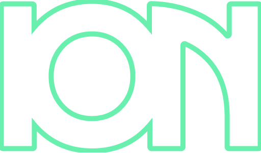

## Ion Inventory Web App
<!-- REPLACE ALL THE [USERNAME] TEXT WITH YOUR GITHUB PROFILE NAME & THE [PROJECTNAME] WITH THE NAME OF YOUR GITHUB PROJECT -->
<!-- Repository Information & Links-->
<br />


<br/>
<!-- Refer to https://shields.io/ for more information and options about the shield links at the top of the ReadMe file -->
[![LinkedIn][linkedin-shield]][linkedin-url]
[![Behance][behance-shield]][behance-url]
<!-- [![Instagram][instagram-shield]][instagram-url] -->


[linkedin-shield]: https://img.shields.io/badge/-LinkedIn-black.svg?style=flat-square&logo=linkedin&colorB=555
[linkedin-url]: https://www.linkedin.com/in/dylanvanhout.1/
<!-- [instagram-shield]: https://img.shields.io/badge/-Instagram-black.svg?style=flat-square&logo=instagram&colorB=555 -->
<!-- [instagram-url]: https://www.instagram.com/instagram_handle/ -->
[behance-shield]: https://img.shields.io/badge/-Behance-black.svg?style=flat-square&logo=behance&colorB=555
[behance-url]: https://www.behance.net/dylanvanhout/

<!-- HEADER SECTION -->
<h5 align="center" style="padding:0;margin:0;">Dylan Vanhout</h5>
<h5 align="center" style="padding:0;margin:0;">190160</h5>
<h6 align="center">IDV300 2022</h6>
</br>
<p align="center">

  <a href="https://github.com/hellodvh/ion-inventory-web-app">
    
  </a>
  
  <h3 align="center">ION - The Inventory</h3>

  <p align="center">
    Building EV's of the Future! <br>
      <a href="https://github.com/hellodvh/ion-inventory-web-app"><strong>Explore the docs »</strong></a>
   <br />
   <br />
   <a href="path/to/demonstration/video">View Demo</a>
    ·
    <a href="https://github.com/hellodvh/ion-inventory-web-app/issues">Report Bug</a>
    ·
    <a href="https://github.com/hellodvh/ion-inventory-web-app/issues">Request Feature</a>
</p>
<!-- TABLE OF CONTENTS -->

## Table of Contents
<details>
  <summary>Show Contents</summary>
  
- [Ion Inventory Web App](#ion-inventory-web-app)
- [Table of Contents](#table-of-contents)
- [About the Project](#about-the-project)
  - [Project Description](#project-description)
  - [Built With](#built-with)
  - [also built with...](#also-built-with)
- [Getting Started](#getting-started)
  - [Prerequisites](#prerequisites)
  - [How to install](#how-to-install)
  - [Installation](#installation)
- [Features and Functionality](#features-and-functionality)
  - [Feature 1](#feature-1)
  - [Feature 2](#feature-2)
  - [Feature 3](#feature-3)
- [Concept Process](#concept-process)
  - [Research:](#research)
  - [Ideation:](#ideation)
  - [Wireframes](#wireframes)
  - [User-flow](#user-flow)
- [Development Process](#development-process)
  - [Implementation Process](#implementation-process)
    - [Highlights](#highlights)
    - [Challenges](#challenges)
  - [Reviews & Testing](#reviews--testing)
  - [Future Implementation](#future-implementation)
- [Final Outcome](#final-outcome)
  - [Mockups](#mockups)
  - [Video Demonstration](#video-demonstration)
- [Roadmap](#roadmap)
- [Contributing](#contributing)
- [Authors](#authors)
- [License](#license)
- [Contact](#contact)
- [Acknowledgements](#acknowledgements)
  
</details>


</br>

<!--PROJECT DESCRIPTION-->
## About the Project
Brief Overview: Design and Develope a C# and ASP.net Core Web Application for an Inventory using Razor Pages and MySQL database.
<!-- header image of project -->
![image1][image1]

## Project Description

Ion Inventory System: an interactive web application built with C#, ASP.net Core, MVC, and Razor Pages. The theme of the web app is Electric Vehicle Industry with a focus on inventory management, manufacturing and assembly. The idea for the name 'ion' came from the word Lithium-ion, the active ingredient used in electric vehicle battery cells.

The Inventory web app makes use of Four main locations for managing iventory items and crafting new items, which includes: Inventory, Manufacturing, Assembly and Garage. Each location has its own features and functions used to change and update database data.

Bootstrap 5 was used for the html and csss of this project. For the colours of the UI I opted to make use of darkmode aesthetic with bright teal and orange for the primary and secondary colours to make the aesthetic visually eye catching and noticable on the black and grey backgrounds. White was used for the body text aswell as for the different materials, parts and vehicle images. The CSS Style guide linked in the projected provides the Bootstrap CSS needed to style the various elements.

For the backend the web app makes use of a MySQL Database with tables for the materials, parts, vehicles and tickets. C#, ASP.net Core and MVC Architecture pattern is used to generate the frontend and structure the logic and business needs of the project.

These are the outcomes of the course work and brief for the term : 

 - [x] Implement a ASP.NET based project
 - [x] Implement a web application with C#
 - [x] Create complex data structures with inheritance and polymorphism
 - [x] Create and manage a SQL Database with queries
 - [x] Implement a user driven front end design
 - [x] Show consistent and effective version control
 - [x] Professionally present final work
 - [x] Conduct and implement research on subject matter
 - [x] Implement a data driven UI

</br>

### Built With

* [C#](https://docs.microsoft.com/en-us/dotnet/csharp/)
* [ASP.net Core](https://docs.microsoft.com/en-us/aspnet/core/?view=aspnetcore-6.0)
* [Razor Pages](https://docs.microsoft.com/en-us/aspnet/core/razor-pages/?view=aspnetcore-6.0&tabs=visual-studio)
* [WAMP Server](https://www.wampserver.com/en/)
* [phpMyAdmin](https://www.phpmyadmin.net/)
* [MySQL](https://dev.mysql.com/doc/)

### also built with...
* [bootstrap-dark | vinorodrigues](https://vinorodrigues.github.io/bootstrap-dark/)
* [Font Awesome Icons](https://fontawesome.com/)
* [Google Fonts](https://fonts.google.com/)

<!-- GETTING STARTED -->
<!-- Make sure to add appropriate information about what prerequesite technologies the user would need and also the steps to install your project on their own mashines -->
## Getting Started
</br>
<details>
  <summary>Show Getting Started</summary>
</br>

The following instructions will get you a copy of the project up and running on your local machine for development and testing purposes.

### Prerequisites

Ensure that you have the latest version of [.NET 6.0](https://dotnet.microsoft.com/en-us/downloade), [Visual Studio 2022](https://visualstudio.microsoft.com/downloads/), and [WAMP localhost](https://sourceforge.net/projects/wampserver/) installed on your machine. 

<!--The [Plugin](path/to/where/they/can/download/plugin) plugin will also be required.-->

### How to install

### Installation
Here are a couple of ways to clone this repo:

1. Visual Studio IDE </br>

`Visual Studio` -> `File` -> `Clone Repository` -> `Git`
Enter the Git repository URL into the URL field and press the `Clone` button.
  ```sh 
  https://github.com/hellodvh/ion-inventory-web-app.git
  ``` 
2. Clone Repository

Run the following in the command-line to clone the project:
  ```sh
   git clone https://github.com/hellodvh/ion-inventory-web-app.git
  ```
Open `Visual Studio` and select `File | Open` from the menu. Select `Open Project/Solution` and select the cloned directory and press `Open` button.

3. Install Dependencies </br>
When you build the project for the first time. `Nuget Package Manager` will automatically install any project dependencies and packages required.

4. Implement Database </br>
Run the `localhost server` using `phpMyAdmin` and `Import` the SQL database. Configure the `serverConfiguration` string with 'username', 'password', 'localhost' and 'database'.

5. Build and Run

</details>
</br>


<!-- FEATURES AND FUNCTIONALITY-->
<!-- You can add the links to all of your imagery at the bottom of the file as references -->
## Features and Functionality

![image2][image2]
### Feature 1

Updating stock count quantity of materials.

<!-- ```
Code Snippet 

``` -->

![image3][image3]
### Feature 2

User input authentication using a SHA1 hashing algorithm to convert the plain text into hashed value which is then compared to a value stored in the sql database. This feature was implemented on the parts manufacturing function and the vehicle assembly function.

<!-- ```
Code Snippet 

``` -->

![image4][image4]
### Feature 3

Dashboard Layout with All the Materials, Parts, and Vehicles counts and totals.
Chart JS was used to implement the bar, doughnut, and pie charts.

<!-- ```
Code Snippet 

``` -->

<!-- ![image5][image5]
### Feature 4

Ticket system for adding tickets to the ticket board -->


<!-- CONCEPT PROCESS -->
<!-- Briefly explain your concept ideation process -->
## Concept Process

The `Conceptual Process` is the set of actions, activities and research that was done when starting this project.

### Research: 
I started off by doing research into different types of companies that would need a system for managing inventory and manufacturing. I deciced to focus the project on electic vehicle manufacturing as I thought it was a relevant topic to focus on due to world climate and sustainability. I gathered data about electric vehicles and how they are made. I formulated a list of vehicle parts and the materials used in the parts. I simplified the list into basic types of materials and parts. 

### Ideation:

For the `Ideation Process` I used the requirements provided in the project brief to plan all the required features and functionality of the web app.

I made moodboards of layouts and colour palletes to generate ideas for the frontend layout I wanted to use for the project. I decided to go for a dashboard layout for the usability and responsive design. I sketeched some basic wireframes with ink and paper to get a feel of the layout I wanted to implement. I then proceeded to make high fidelity wireframes in Figma.

Darkmode "insert reference resource here" was used according to this study to help aid in energy effecientcy on device power consumption. Responsive layout allows the web app to be run on table and desktop resolutions.

![image5][image5]
<br>
![image6][image6]

### Wireframes

![image7][image7]

### User-flow

![image8][image8]

<!-- DEVELOPMENT PROCESS -->
# Development Process

The `Development Process` is the technical implementations and functionality done in the frontend and backend of the application.

### Agile 8 Week Sprint
  Dates: Start [2022/02/14] 
  Due[2022/04/08]

### Implementation Process
<!-- stipulate all of the functionality you included in the project -->

### MVC: Architecture
  1. Why 

### Development Environment:
  1. Wamp Local Server was used to run a local MySql Database Server. This was to allow the application to communicate with a database and enable all the functionality.
  2. Visual Studio Code was used as the IDE for this project because it provided a stable development environment and setup.
  3. Git and Github was used for the version control and documentaion of the project.
  4. Windows 11 was my desktop OS (for interest sake).
   
### Razor Pages:
  1. Function 1
  2. Function 2

### C# Language:
  1. Function 1
  2. Function 2

### MySQL 
  1. ERD Diagram

#### Highlights
<!-- stipulated the highlight you experienced with the project -->
* Hightlight 1: I really enjoy learning the C# Language and ASP.net Core Framework because I got to work with Microsoft development environment. Learning Object Orientated Programming was also very important part of learning experience. 

* Hightlight 2: Being able to choose my own theme and concept for the project because I would like to own a Electric Vehicle in the future and I would like to get the change to build or work on more projects similar to this dashboard. I enjoyed making my own version of a dashboard.

* Hightlight 3: Being able to explore a new visual web design style during this project, although I initially design the project with a corporate and miniml design, I decided rather implement a darker and flat design. The fontend was design by using the darkmode aesthetic for the visual elements.

#### Challenges
<!-- stipulated the challenges you faced with the project and why you think you faced it or how you think you'll solve it (if not solved) -->
* Bugs 1:
  The layout of the charts in `Inventory.cshtml` were a bit small when I initially implemented them (before the data was working with the graphs). When I connected the data using the `@foreach` loop, `` method and `sql` query to the database, the doughnut chart and pie chart were squashed by the lables at the top. 
  * Fix Attempt 1: I increased the area height of the charts to take up more space on the desktop layout. This pushed the Lists further down the view. However user is still able to scroll down to view the lists of items.
  <br>
* Bugs 2: 
  The `@foreach` loop in the `Manufacturing.cshtml` does not return the `@part.imageURL` from the database.
  * Fix Attempt 1: For now I have provided the `src=''` with a `/path` to the relevant file in wwwroot folder. A better solution to this problem needs to be used because the image and data should be displayed on the front-end dynamically.

<!--### Reviews & Testing
 stipulate how you've conducted testing in the form of peer reviews, feedback and also functionality testing, like unit tests (if applicable) -->

<!--#### Feedback from Reviews

`Peer Reviews` were conducted by my fellow students and lecturer. The following feedback I found useful:

* Feedback one.
* Feedback two.-->

<!-- #### Unit Tests

`Unit Tests` were conducted to establish working functionality. Here are all the tests that were ran:

* Test 1 of this functionality
* Test 2 of this functionality -->

## Future Implementation
<!-- stipulate functionality and improvements that can be implemented in the future. -->
Aim to implement this by my end year portfolio presentation as continued progress and code maintenance. This is to challenge myself in programming and see if I can implement extra code features and functions.

* Future 1: Implement User Registration and Sign-In using Authentication. (Functionality update)
* Future 1.1: Implement User View Access. Permissions for different types of users. (Functions update)
* Future 2: Deploy and Host Demo on Azure Cloud Services. (Free Tier)
* Future 3: Source 3D Imagery for each item in the database. (Visuals update)
* Future 3.1: Add responsive side bar to the Dashboard. 
* Future 4: Implement Dark/Light mode toggler on the front-end (Function)
* Future 5: Implement CRUD functionality for adding new vehicle recipes. (Functionality update)
* Future 6: Implement CRUD functionality for selling a vehicle and calculate a revenue value (Function update)

<!-- MOCKUPS -->
## Final Outcome

### Mockups

![image9][image9]
<br>
![image10][image10]

<!-- VIDEO DEMONSTRATION -->
### Video Demonstration

To see a run through of the application, click below:

[View Demonstration](path/to/video/demonstration)

<!-- ROADMAP -->
## Roadmap

See the [open issues](https://github.com/hellodvh/ion-inventory-web-app/issues) for a list of proposed features (and known issues).

<!-- CONTRIBUTING -->
## Contributing

Contributions are what makes the open-source community such an amazing place to learn, inspire, and create. Any contributions you make are **greatly appreciated**.

1. Fork the Project
2. Create your Feature Branch (`git checkout -b feature/AmazingFeature`)
3. Commit your Changes (`git commit -m 'Add some AmazingFeature'`)
4. Push to the Branch (`git push origin feature/AmazingFeature`)
5. Open a Pull Request

<!-- AUTHORS -->
## Authors

* **Dylan Vanhout** - [hello](https://github.com/hellodvh)

<!-- LICENSE -->
## License

Distributed under the MIT License. See `LICENSE` for more information.\

<!-- LICENSE -->
## Contact

* **Dylan Vanhout** - [email@address](mailto:dylanvanhout@address) - 
* **Project Link** - https://github.com/hellodvh/ion-inventory-web-app

<!-- ACKNOWLEDGEMENTS -->
## Acknowledgements
<!-- all resources that you used and Acknowledgements here -->
Functionality and programming concepts of the application was learned from the course work provided throughout the term. I used what I learned during lectures to build this. I give credit to my Lecturer Armand who facilitated the lessons on OOP programming, C# Language.

* [Lecturer](https://www.github.com/ArmandPret/)
* [Flat Icons](https://www.flaticons.com)
* [Stack Overflow](https://www.stackoverflow.com/)
* [W3Schools C#](https://www.w3schools.com/)
* [W3Schools SQL](https://www.w3schools.com/)
* [Tesla](https://www.tesla.com)
* [Mockups](path/to/resource)
* [Mockups](path/to/resource)
* [Mockups](path/to/resource)

<!-- MARKDOWN LINKS & IMAGES -->
[image1]: /Screenshots/image1.png
[image2]: /Screenshots/image2.png
[image3]: /Screenshots/image3.png
[image4]: /Screenshots/image4.png
[image5]: /Screenshots/image5.png
[image6]: /Screenshots/image6.png
[image7]: /Screenshots/image7.png
[image8]: /Screenshots/image8.png
[image9]: /Screenshots/image9.png
[image10]: /Screenshots/image10.png
